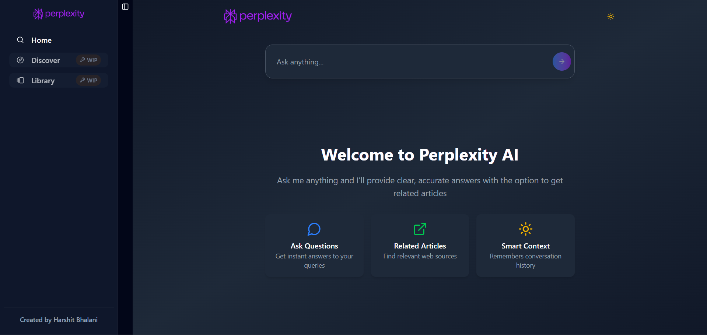

# Perplexity AI Clone

A modern, responsive web application that replicates the core functionality of Perplexity AI, providing intelligent search capabilities with AI-powered answers and source citations.

<div align="center">
  
  <p><em>Clean, modern interface for AI-powered search</em></p>
</div>

## 🚀 Live Demo

**[View Live Demo](https://perplexity-ai-plum.vercel.app/)**

## 📋 Table of Contents

- [Features](#features)
- [Tech Stack](#tech-stack)
- [Getting Started](#getting-started)
- [Installation](#installation)
- [Configuration](#configuration)
- [Usage](#usage)
- [Project Structure](#project-structure)
- [API Integration](#api-integration)
- [Deployment](#deployment)
- [Security & Privacy](#security--privacy)
- [Contributing](#contributing)
- [License](#license)
- [Third-Party Services](#third-party-services--apis)
- [Disclaimer](#disclaimer)
- [Attribution](#attribution)

## ✨ Features

### Core Functionality
- **AI-Powered Search**: Get instant, accurate answers to any query
- **Source Citation**: Automatically provides relevant web sources for answers
- **Conversation History**: Maintains context across multiple queries
- **Real-time Responses**: Streaming responses for better user experience
- **Responsive Design**: Works seamlessly across desktop and mobile devices

### Advanced Features
- **Related Articles**: Discover additional relevant content
- **Clean UI/UX**: Modern, intuitive interface similar to Perplexity AI
- **Fast Performance**: Optimized for speed and efficiency
- **Error Handling**: Robust error management and user feedback
- **Search Suggestions**: Intelligent query suggestions and autocomplete

## 🛠 Tech Stack

### Frontend
- **Framework**: Next.js 14 (React)
- **Styling**: Tailwind CSS
- **UI Components**: Shadcn/ui
- **Icons**: Lucide React
- **Animations**: Framer Motion
- **Type Safety**: TypeScript

### Backend & APIs
- **AI Model**: OpenAI GPT API
- **Search API**: Tavily Search API / SerpAPI
- **Deployment**: Vercel
- **Environment**: Node.js

### Additional Tools
- **State Management**: React Hooks (useState, useEffect)
- **HTTP Client**: Axios / Fetch API
- **Markdown Processing**: React Markdown
- **Code Highlighting**: Prism.js

## 🚀 Getting Started

### Prerequisites

Before running this project, make sure you have:

- **Node.js** (v18 or higher)
- **npm** or **yarn** package manager
- **OpenAI API Key**
- **Search API Key** (Tavily or SerpAPI)

### Installation

1. **Clone the repository**
   ```bash
   git clone https://github.com/HarshitBhalani/Perplexity-AI.git
   cd Perplexity-AI
   ```

2. **Install dependencies**
   ```bash
   npm install
   # or
   yarn install
   ```

3. **Set up environment variables**
   
   Create a `.env.local` file in the root directory:
   ```env
   # OpenAI Configuration
   OPENAI_API_KEY=your_openai_api_key_here
   
   # Search API Configuration
   TAVILY_API_KEY=your_tavily_api_key_here
   # OR
   SERPAPI_KEY=your_serpapi_key_here
   
   # Application Configuration
   NEXT_PUBLIC_APP_URL=http://localhost:3000
   ```

4. **Run the development server**
   ```bash
   npm run dev
   # or
   yarn dev
   ```

5. **Open your browser**
   
   Navigate to [http://localhost:3000](http://localhost:3000) to see the application.

## ⚙️ Configuration

### API Keys Setup

#### OpenAI API Key
1. Visit [OpenAI Platform](https://platform.openai.com/)
2. Create an account or log in
3. Navigate to API Keys section
4. Create a new secret key
5. Add it to your `.env.local` file

#### Tavily API Key (Recommended)
1. Visit [Tavily](https://tavily.com/)
2. Sign up for an account
3. Get your API key from the dashboard
4. Add it to your `.env.local` file

#### Alternative: SerpAPI Key
1. Visit [SerpAPI](https://serpapi.com/)
2. Create an account
3. Get your API key
4. Add it to your `.env.local` file

## 💡 Usage

### Basic Search
1. Enter your question in the search bar
2. Press Enter or click the search button
3. Wait for AI to process and provide an answer
4. Review the sources and related articles

### Advanced Features
- **Follow-up Questions**: Ask related questions to continue the conversation
- **Source Exploration**: Click on source links to read full articles
- **Copy Responses**: Use the copy button to save answers
- **Clear History**: Reset conversation history when needed

## 📁 Project Structure

```
perplexity-ai/
├── components/
│   ├── ui/                 # Shadcn UI components
│   ├── SearchBar.tsx       # Search input component
│   ├── SearchResults.tsx   # Results display component
│   ├── SourceCard.tsx      # Source citation component
│   └── ConversationHistory.tsx
├── pages/
│   ├── api/
│   │   ├── search.ts       # Search API endpoint
│   │   └── chat.ts         # Chat API endpoint
│   ├── _app.tsx           # App configuration
│   ├── _document.tsx      # Document structure
│   └── index.tsx          # Main page
├── lib/
│   ├── openai.ts          # OpenAI configuration
│   ├── search.ts          # Search API utilities
│   └── utils.ts           # Helper functions
├── styles/
│   └── globals.css        # Global styles
├── public/
│   └── favicon.ico        # App icon
├── .env.local             # Environment variables
├── next.config.js         # Next.js configuration
├── tailwind.config.js     # Tailwind CSS configuration
├── tsconfig.json          # TypeScript configuration
└── package.json           # Dependencies
```

## 🔌 API Integration

### OpenAI Integration
The app uses OpenAI's GPT model for generating intelligent responses:

```typescript
// lib/openai.ts
import OpenAI from 'openai';

const openai = new OpenAI({
  apiKey: process.env.OPENAI_API_KEY,
});

export async function generateResponse(query: string, context: string) {
  const response = await openai.chat.completions.create({
    model: "gpt-4",
    messages: [
      {
        role: "system",
        content: "You are a helpful AI assistant that provides accurate, well-sourced answers."
      },
      {
        role: "user",
        content: `Context: ${context}\n\nQuestion: ${query}`
      }
    ],
    temperature: 0.7,
    max_tokens: 1000,
  });
  
  return response.choices[0].message.content;
}
```

### Search API Integration
The app fetches relevant web sources using Tavily or SerpAPI:

```typescript
// lib/search.ts
export async function searchWeb(query: string) {
  const response = await fetch('https://api.tavily.com/search', {
    method: 'POST',
    headers: {
      'Content-Type': 'application/json',
      'Authorization': `Bearer ${process.env.TAVILY_API_KEY}`
    },
    body: JSON.stringify({
      api_key: process.env.TAVILY_API_KEY,
      query: query,
      search_depth: "advanced",
      include_answer: true,
      include_sources: true,
      max_results: 5
    })
  });
  
  return response.json();
}
```

## 🚀 Deployment

### Vercel Deployment (Recommended)

1. **Push to GitHub**
   ```bash
   git add .
   git commit -m "Initial commit"
   git push origin main
   ```

2. **Deploy to Vercel**
   - Connect your GitHub repository to Vercel
   - Add environment variables in Vercel dashboard
   - Deploy automatically

3. **Environment Variables in Vercel**
   - `OPENAI_API_KEY`
   - `TAVILY_API_KEY`
   - `NEXT_PUBLIC_APP_URL`

### Alternative Deployment Options

#### Netlify
1. Build the project: `npm run build`
2. Deploy the `out` folder to Netlify
3. Set environment variables in Netlify dashboard

#### Docker
```dockerfile
FROM node:18-alpine
WORKDIR /app
COPY package*.json ./
RUN npm install
COPY . .
RUN npm run build
EXPOSE 3000
CMD ["npm", "start"]
```

## 🤝 Contributing

We welcome contributions! Here's how to get started:

1. **Fork the repository**
2. **Create a feature branch**
   ```bash
   git checkout -b feature/amazing-feature
   ```
3. **Make your changes**
4. **Commit your changes**
   ```bash
   git commit -m "Add amazing feature"
   ```
5. **Push to the branch**
   ```bash
   git push origin feature/amazing-feature
   ```
6. **Open a Pull Request**

### Development Guidelines
- Follow TypeScript best practices
- Use ESLint and Prettier for code formatting
- Write meaningful commit messages
- Add tests for new features
- Update documentation as needed

## 📝 License

This project is licensed under the MIT License. See the [LICENSE](LICENSE) file for details.

### MIT License Summary

```
MIT License

Copyright (c) 2025 Harshit Bhalani

Permission is hereby granted, free of charge, to any person obtaining a copy
of this software and associated documentation files (the "Software"), to deal
in the Software without restriction, including without limitation the rights
to use, copy, modify, merge, publish, distribute, sublicense, and/or sell
copies of the Software, and to permit persons to whom the Software is
furnished to do so, subject to the following conditions:

The above copyright notice and this permission notice shall be included in all
copies or substantial portions of the Software.

THE SOFTWARE IS PROVIDED "AS IS", WITHOUT WARRANTY OF ANY KIND, EXPRESS OR
IMPLIED, INCLUDING BUT NOT LIMITED TO THE WARRANTIES OF MERCHANTABILITY,
FITNESS FOR A PARTICULAR PURPOSE AND NONINFRINGEMENT. IN NO EVENT SHALL THE
AUTHORS OR COPYRIGHT HOLDERS BE LIABLE FOR ANY CLAIM, DAMAGES OR OTHER
LIABILITY, WHETHER IN AN ACTION OF CONTRACT, TORT OR OTHERWISE, ARISING FROM,
OUT OF OR IN CONNECTION WITH THE SOFTWARE OR THE USE OR OTHER DEALINGS IN THE
SOFTWARE.
```

### Third-Party Services & APIs

This project uses the following third-party services, each with their own terms:

- **OpenAI API**: Subject to [OpenAI's Terms of Service](https://openai.com/terms/)
- **Tavily Search API**: Subject to [Tavily's Terms of Service](https://tavily.com/terms)
- **SerpAPI** (alternative): Subject to [SerpAPI's Terms of Service](https://serpapi.com/terms)
- **Vercel**: Subject to [Vercel's Terms of Service](https://vercel.com/legal/terms)

### Disclaimer

This project is a clone/replica of Perplexity AI created for educational and demonstration purposes. It is not affiliated with, endorsed by, or connected to Perplexity AI or its creators. All trademarks, service marks, and trade names referenced in this project are the property of their respective owners.

### Attribution

If you use this project or create derivative works, please provide appropriate attribution:

```
Based on Perplexity AI Clone by Harshit Bhalani
GitHub: https://github.com/HarshitBhalani/Perplexity-AI
```

## 🙏 Acknowledgments

- [Perplexity AI](https://perplexity.ai/) for the inspiration
- [OpenAI](https://openai.com/) for the AI capabilities
- [Tavily](https://tavily.com/) for the search API
- [Vercel](https://vercel.com/) for hosting
- [Shadcn/ui](https://ui.shadcn.com/) for UI components

## 📞 Support

If you have any questions or issues:

1. Check the [Issues](https://github.com/HarshitBhalani/Perplexity-AI/issues) page
2. Create a new issue if your problem isn't already addressed
3. Contact the maintainer: [Harshit Bhalani](https://github.com/HarshitBhalani)

## 🔄 Changelog

### Version 1.0.0
- Initial release with core Perplexity AI features
- AI-powered search and response generation
- Source citation and related articles
- Responsive design and modern UI

---

**⭐ If you found this project helpful, please consider giving it a star on GitHub!**
